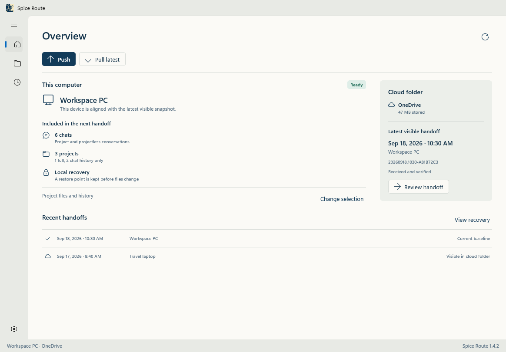
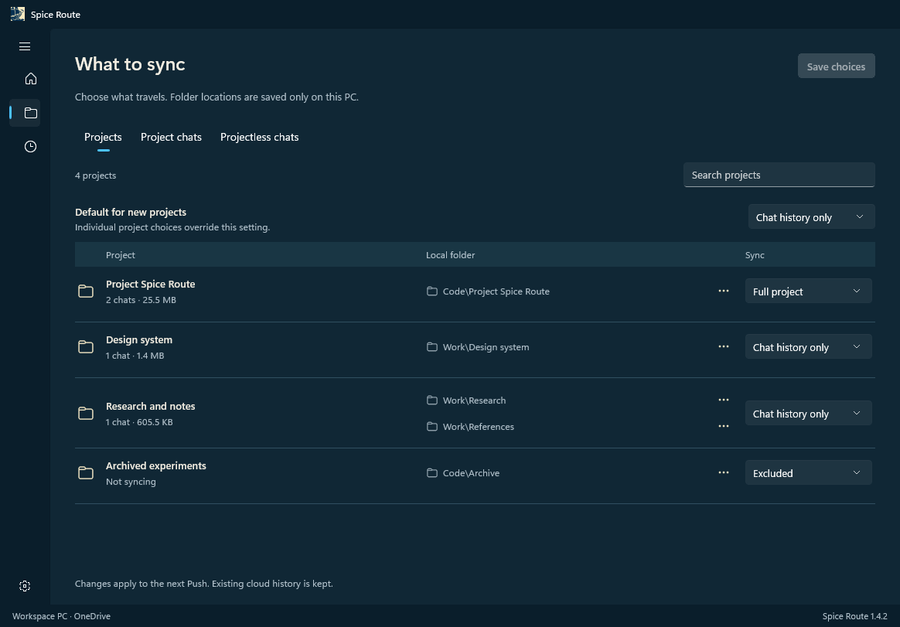
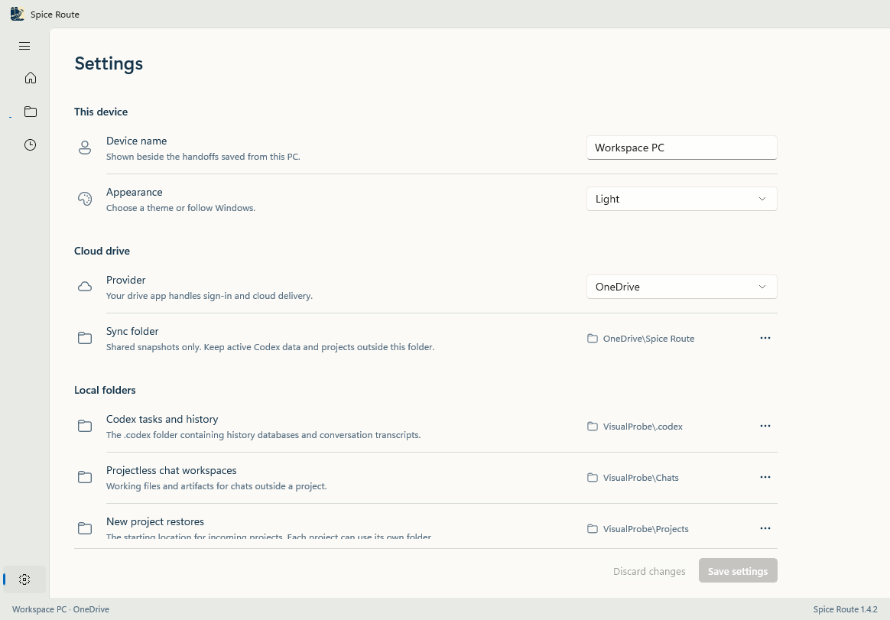
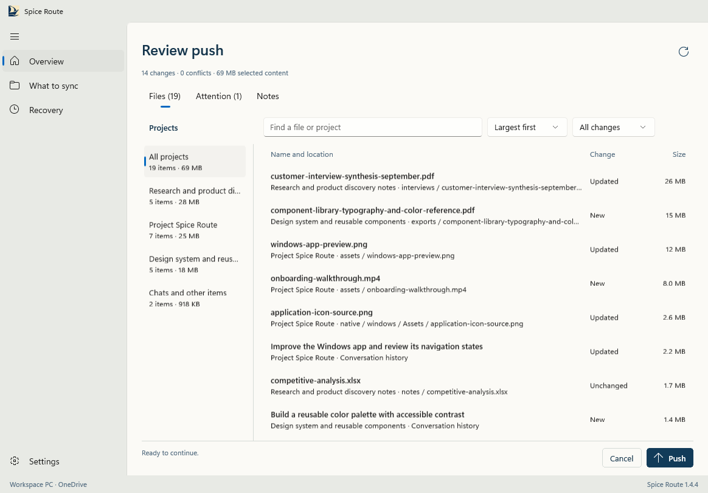
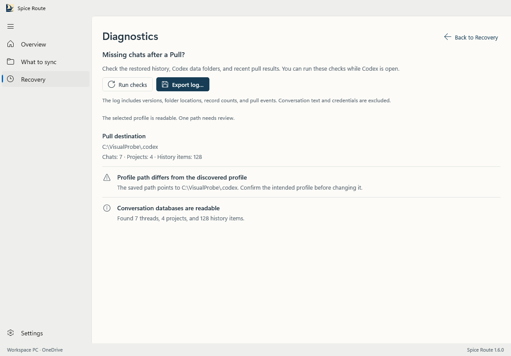

<p align="center">
  
</p>

# Project Spice Route

**Your Codex conversations and project work, ready for the next computer.**

Sometimes you start something at your desk and want to pick it up on your laptop. The conversation matters, but so do the files, the unfinished changes, and the place you left off. Spice Route brings them together in a handoff you can review before anything moves.

Spice Route is a desktop app for Windows and macOS that transfers selected Codex chats and project workspaces through a folder managed by **Google Drive, OneDrive, or iCloud Drive**. Choose what travels, push from one computer, and pull on the other. Your existing cloud client handles sign-in and delivery.

[Windows x64](artifacts/Spice-Route-1.5.2-windows-x64-setup.exe) · [Windows ARM64](artifacts/Spice-Route-1.5.2-windows-arm64-setup.exe) · [macOS Apple Silicon](artifacts/macos-apple-silicon/Spice-Route-1.5.2-macos-apple-silicon.dmg) · [macOS Intel](artifacts/macos-intel/Spice-Route-1.5.2-macos-intel.dmg) · [Getting started](#getting-started) · [Report an issue](https://github.com/desigrit/project-spice-route/issues)



*All screenshots show the actual WinUI 3 interface in version 1.4.4, captured with sample data. No personal conversations are shown.*

## A little context before you begin

**The current desktop version is 1.5.2.** Windows has separate native x64 and ARM64 packages, while macOS has Apple Silicon and Intel packages. This release accepts Codex patch-runtime changes when the complete database profile is still an exact tested match. It also replaces the Windows app payload cleanly during upgrades, tightens target-architecture checks for native runtime files, and keeps startup failures visible with a detailed local log. Install the same Spice Route version on every computer before exchanging snapshots. Interactive testing and a live transfer between devices remain validation steps, so keep an independent backup of work you cannot replace.

The Workspace interface uses actual WinUI 3 navigation, menus, folder pickers, and virtualized lists. The menu opens with labels visible, and Review keeps the project filter and file columns aligned. Review has separate Files, Attention, and Notes tabs, with project filters and large files first. Push and Pull stay in a consistent action row, while timestamped handoff labels make snapshots easier to match across computers.

This is an independent project, not an official OpenAI product. It works with Codex's local storage, which can change between releases. Unknown formats are blocked until an adapter has been tested. The first macOS packages use ad-hoc signing and are intended for hands-on testing before a notarized release.

## Choose what comes with you

You do not have to move every project just to bring a conversation along.

| Content | What travels | Your controls |
| --- | --- | --- |
| Projectless chats | Selected history, transcripts, supported attachments, and workspace files within the configured workspace folder | All chats, including archived chats, are selected by default. Exclude individual chats as needed. |
| Full project | Project listing, chats, selected files, Git history, and working state | Set a default for new projects, then override any project. |
| Chat history only | Project listing and chats, without the project's code or working files | Keep a reference on a device that does not need the whole project. |
| Excluded project | No further transfer | Existing local copies and retained cloud snapshots stay in place. |

Each project has its own local folder. One can live on `D:`, another on `E:`, and a linked worktree somewhere else. Folder mappings stay on the current computer, while your sync selections are shared across devices.

Recognized dependencies, caches, and build outputs are excluded by default, including generated packaging output and staging folders. New configurations include project files such as `.env`, local credentials, keys, and certificates. Existing installations keep their saved choices; enable **Project secrets and configuration** in Settings if you want those files to travel. Custom exclusions still apply. Git history is transferred intact.



## Getting started

### 1. Install the desktop app

On Windows, choose the package that matches the processor:

- [Windows x64](artifacts/Spice-Route-1.5.2-windows-x64-setup.exe) for Intel and AMD computers
- [Windows ARM64](artifacts/Spice-Route-1.5.2-windows-arm64-setup.exe) for Windows on Arm computers

Each installer bundles .NET, Windows App SDK, and the matching C++ runtime. You do not need Node.js, Rust, or development scripts to use it.

The installers are not code-signed, so Windows may show a SmartScreen warning. SHA-256 checksums are included beside both downloads. Check your copy in PowerShell:

```powershell
Get-FileHash .\Spice-Route-1.5.2-windows-x64-setup.exe -Algorithm SHA256
Get-FileHash .\Spice-Route-1.5.2-windows-arm64-setup.exe -Algorithm SHA256
```

You will also need Codex and an installed cloud drive client. Git must be available when transferring Git repositories. The native interface does not use WebView2.

Version 1.5.2 installs under `%LOCALAPPDATA%\Programs\Spice Route`. Close Spice Route before running the installer. An upgrade replaces the complete app payload so an obsolete native runtime file cannot remain beside the new version. Your saved device identity, folder choices, and recovery history remain in the separate local Spice Route profile. Do not run two copies against the same profile at once.

On macOS, download the [Apple Silicon DMG](artifacts/macos-apple-silicon/Spice-Route-1.5.2-macos-apple-silicon.dmg) for M-series Macs or the [Intel DMG](artifacts/macos-intel/Spice-Route-1.5.2-macos-intel.dmg) for Intel Macs. Open the DMG and move Spice Route to Applications. These first packages are ad-hoc signed and are not notarized. If macOS blocks the first launch, open **System Settings > Privacy & Security** and approve Spice Route there.

### 2. Connect a cloud folder

Sign in through the Google Drive, OneDrive, or iCloud desktop client first. In Spice Route, give your computer a recognizable name and choose a dedicated folder inside that drive, such as `OneDrive\Spice Route`.

Choose the corresponding synced folder on the other computer. Spice Route uses that folder for snapshots; keep active Codex data and working project folders outside it.

### 3. Confirm the local folders

These folders have different jobs:

| Folder | What it contains | Where to configure it |
| --- | --- | --- |
| Codex task and history folder | Codex databases, metadata, and transcript files, usually under `.codex` | Onboarding or Settings |
| Projectless chat workspaces folder | Working files and artifacts associated with chats outside a project | Onboarding or Settings |
| A project's local folder | That project's code and working files | The folder's **…** menu in What to sync |

The projectless workspace folder is not a replacement for Codex's internal transcript directory. Chats still need the task and history folder to transfer correctly.

On macOS, a typical setup uses `/Users/your-name/.codex` for Codex tasks and history, and `/Users/your-name/Documents/Codex Sessions` for projectless working files. Do not select `~/.codex/sessions` as the projectless workspace folder. That directory contains Codex's internal session transcripts and is already covered by the task and history folder.

When you first pull a full project onto another computer, Spice Route asks where that project should live. An optional default restore location can prefill suggestions, but each project gets its own confirmed destination. Changing a mapping does not move existing files.



### 4. Review your selection

Open **What to sync**. Keep full projects, switch some to **Chat history only**, or exclude what you do not need. Search the chat lists to make individual exclusions, then save your choices.

## The everyday handoff

Use one computer at a time for a given handoff. Push before you leave, and pull before you resume on the other device.

Review gives you room to inspect the handoff. Filter by project, search for a file or conversation, and check Attention for anything that needs a decision. Files keep their own scrolling area, so notices do not crowd them out.



**On the computer you are leaving:**

1. Finish your active Codex work and close Codex. This helps keep the preview stable.
2. Choose **Push** and review the proposed changes.
3. Complete the Push and note its handoff ID.
4. Wait for your cloud client to finish syncing.

**On the computer you are moving to:**

1. Wait for the cloud client to receive the files.
2. Match the visible snapshot's source, time, and handoff ID with the one you pushed.
3. Choose **Pull**, confirm any project folders, and review conflicts.
4. Apply the handoff, then open Codex yourself and continue your work.

If Codex is still open, Spice Route can request a graceful exit. It blocks the transfer while known Codex writers remain running. If local work changes after a preview, make a fresh review before proceeding.

### What the cloud status means

A file appearing in your local drive folder does not prove it has reached another computer. Spice Route keeps these states distinct:

| Status | Meaning |
| --- | --- |
| Saved to sync folder | This computer finished writing the snapshot into its local cloud folder. |
| Visible in sync folder | A snapshot manifest is visible here. Its required content still needs checking. |
| Received and verified | This computer read the required objects and verified their content hashes. |

The current folder-based integration cannot universally confirm a provider's upload completion. Use the drive client's status and match handoff IDs across computers. Spice Route does not declare remote delivery successful after a timer.

## When both copies have changed

Spice Route compares changes with a shared ancestor, rather than choosing whichever file has the newest timestamp. Separate chat changes can coexist. When the same chat or project has changed on both sides, you choose:

- **Keep mine** retains the current local version.
- **Use incoming** selects the version in the incoming snapshot.

Conversation histories are not concatenated. Choosing a version is a real content decision, not simply a way to dismiss a warning.

If a computer has no saved sync baseline, it can take either path. Pull compares the visible handoff with the local copy and lets you choose versions. Push opens an explicit replacement review and can make the current selection authoritative, including a chats-only selection that omits previously shared project files. The preview becomes stale if another device publishes before execution, so a newly visible head cannot be overwritten without a fresh review.

Before applying a Pull, Spice Route creates a local rollback set. Interrupted operations appear in **Recovery**, and new transfers are blocked until recovery is resolved. The latest ten completed rollback sets are retained, along with unresolved recovery data.


## What stays local

Global Codex settings, credentials, device identity, task permission configuration, queues, skills, plugins, and automations stay on their own computer. Running terminals, processes, browser sessions, and installed toolchains cannot travel in a snapshot.

Other useful boundaries:

- **Chat history only is not a read-only lock in Codex.** A managed empty folder may be used when Codex requires a project root, but the mode does not guarantee that replying is disabled.
- **External Git resources need separate attention.** Git LFS objects outside the checkout and external submodule resources are not fully portable through this release.
- **Old stored objects can remain.** A replacement Push removes omitted items from the new visible handoff, but content-addressed objects from older snapshots can remain in the sync folder. Reset cloud history is the explicit storage cleanup action.
- **There is no app-level encryption.** Snapshots contain readable history and compressed project content. Use a cloud folder and account appropriate for that work.
- **Large repositories still take time.** Previews avoid unnecessary compression, but content hashing and Git capture remain part of the comparison.

## Codex compatibility

Spice Route validates the complete database structure before allowing writes and records the detected runtime for diagnostics. Codex patch releases can keep an identical storage format, so a runtime string by itself does not decide compatibility.

| State / history migrations | Reference runtime | Requirement |
| --- | --- | --- |
| `52 / 6` | `0.153.4` | Exact tested tables, indexes, triggers, and completed migrations |
| `54 / 6` | `0.154.0-alpha.6.2` | Exact tested tables, indexes, triggers, and completed migrations |
| `55 / 6` | `0.155.0-alpha.9.2` | Exact tested tables, indexes, triggers, and completed migrations |
| Other database layouts | Any | Diagnostics only until a matching adapter is tested |

Transfers keep the destination's own database schema. Older records can move into the supported newer profile. A transfer in the reverse direction is blocked if it contains newer fields the older profile cannot represent. Those values are never silently discarded. Schema 55 renames the attachment table; Spice Route translates that rename while retaining a consistent snapshot representation, so existing snapshots remain readable. It does not replace whole databases because selections, unrelated destination chats, and local settings must be preserved.

See the [compatibility design](docs/compatibility-plan.md) and [1.5.2 testing notes](docs/testing-1.5.2.md) for the exact boundaries. The verification guide records the current Rust, frontend, native engine-client, and package checks. Real-device history display, continuation, and cloud-client behavior remain part of manual acceptance.

## Build from source

The Windows app uses **WinUI 3**, **C#**, and the shared **Rust sync engine**. The macOS app uses **Tauri 2**, **React**, the system WebKit view, and the same engine. No hosted service is involved.

Both interfaces use the 1.5.2 engine for compatibility checks, snapshot capture, transfer performance, settings validation, progress reporting, diagnostics, and recovery. See the [performance audit](docs/performance-audit.md) for measured background.

To build the native Windows installer, install the .NET 9 SDK, Rust's Windows MSVC toolchain, Visual Studio C++ Build Tools, a Windows SDK, and NSIS 3. Then run:

```powershell
git clone https://github.com/desigrit/project-spice-route.git
cd project-spice-route
rustup toolchain install stable-x86_64-pc-windows-msvc
./scripts/build-native-windows.ps1
```

The script produces `artifacts/Spice-Route-1.5.2-windows-x64-setup.exe` and its checksum. Pass `-Architecture arm64` for the native Windows on Arm package. It builds and packages the application without opening it when `-SkipStartupProbe` is supplied. See the [1.5.2 verification guide](docs/testing-1.5.2.md) for engine-client tests and interactive acceptance checks.

### macOS app

On macOS, install:

- Node.js 22.12 or newer and npm.
- Rust with the Apple Silicon or Intel target for your Mac.
- Xcode Command Line Tools and Git.

```bash
git clone https://github.com/desigrit/project-spice-route.git
cd project-spice-route
npm ci
rustup target add aarch64-apple-darwin
```

Start the actual desktop app for development:

```bash
npm run tauri dev
```

`npm run dev` starts only Vite's browser interface. Use `npm run tauri dev` when testing native dialogs, discovery, Push, or Pull.

Run the checks:

```bash
npm test
npm run build
cargo test --release --manifest-path src-tauri/core/Cargo.toml
cargo clippy --release --manifest-path src-tauri/core/Cargo.toml --all-targets -- -D warnings
```

Build the Apple Silicon app and DMG:

```bash
bash ./scripts/build-macos.sh aarch64-apple-darwin 1.5.2 apple-silicon
```

Use `x86_64-apple-darwin` and `intel` for an Intel Mac. The script writes the DMG, zipped app, and checksums under `artifacts/macos-apple-silicon` or `artifacts/macos-intel`. Local packages use ad-hoc signing. Normal public distribution still requires an Apple Developer identity and notarization.

The [desktop build workflow](.github/workflows/desktop-builds.yml) compiles Windows x64, Windows ARM64, macOS Apple Silicon, and macOS Intel packages from version tags. Each Windows job validates the app, engine, and native runtime architecture before producing its installer.

### A quick map of the code

```text
src/                       React interface, themes, and frontend tests
native/windows/            WinUI 3 app and per-user installer definition
native/tests/              Headless native engine-client contract tests
src-tauri/src/             Sync engine, Codex adapter, recovery, and platform code
src-tauri/src/fixtures/    Sanitized database schema fixtures
src-tauri/core/            Engine crate, native sidecar, and standalone tests
scripts/                   Build helpers, diagnostics, and headless visual checks
docs/                      Architecture, compatibility, and testing notes
artifacts/                 Current Windows installer and checksum
```

Read [the architecture notes](docs/architecture.md) for the storage format and transfer flow, or [the validation guide](docs/validation.md) for test coverage and release gates.

To reproduce the sample screenshots and visual checks, see [the screenshot guide](docs/images/README.md). These checks use fabricated content and do not open personal Codex profiles.

## Help shape the next version

If Pull finishes but Codex shows no history, open **Recovery > Diagnose missing chats** on the affected computer, then choose **Export log**. The report checks Codex folder candidates, restored record counts, and available pull events. It excludes conversation text and credentials. New pulls keep diagnostic events automatically; an earlier pull can still be investigated from its saved baseline and the current local profile.



If a handoff feels confusing or something fails, please [open an issue](https://github.com/desigrit/project-spice-route/issues). Include the Spice Route version, Codex versions on both computers, the cloud client, and the exact error. A short description of what you expected is especially useful. Keep private conversations, credentials, and full database files out of public reports.

The next milestones are reliable Windows and macOS round trips across supported cloud clients, continued Codex compatibility coverage, and notarized Mac distribution. Small, well-tested improvements to the interface and recovery flow are welcome along the way.
