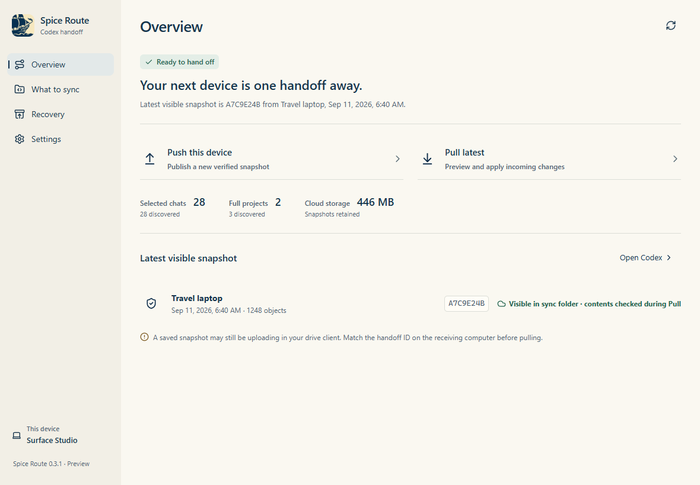
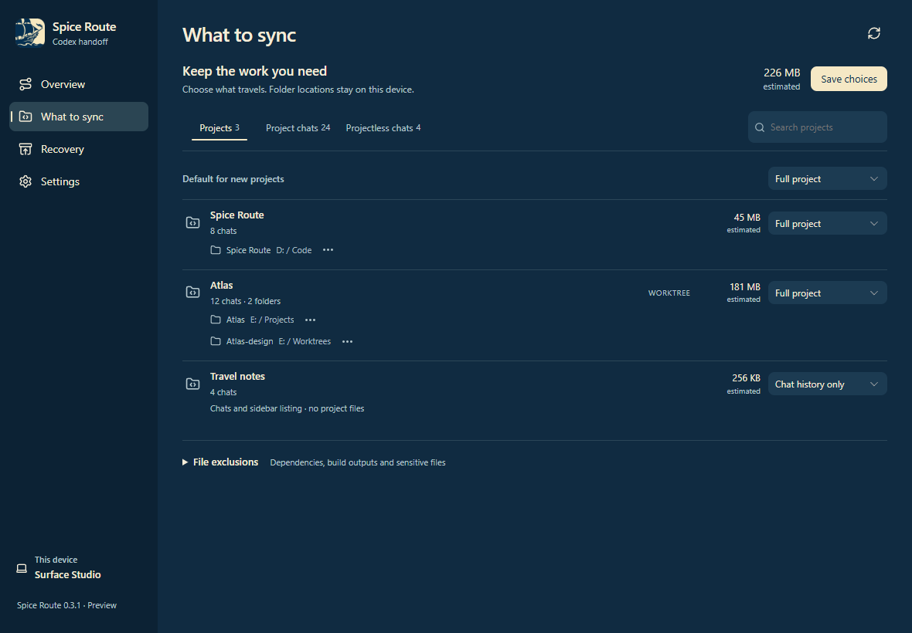
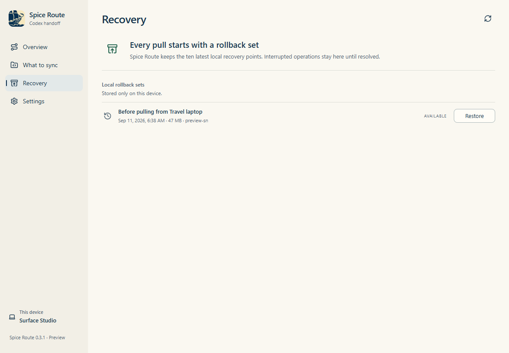

<p align="center">
  
</p>

# Project Spice Route

**Your Codex conversations and project work, ready for the next computer.**

Sometimes you start something at your desk and want to pick it up on your laptop. The conversation matters, but so do the files, the unfinished changes, and the place you left off. Spice Route brings them together in a handoff you can review before anything moves.

Spice Route is a Windows desktop app that transfers selected Codex chats and project workspaces through a folder managed by **Google Drive, OneDrive, or iCloud Drive**. Choose what travels, push from one computer, and pull on the other. Your existing cloud client handles sign-in and delivery.

[Download the Windows preview](https://github.com/desigrit/project-spice-route/raw/refs/heads/main/artifacts/Spice-Route-0.3.1-x64-setup.exe) · [Getting started](#getting-started) · [Build from source](#build-from-source) · [Report an issue](https://github.com/desigrit/project-spice-route/issues)



*Screenshots are rendered from the app's interface with sample data. No personal conversations are shown.*

## A little context before you begin

**The current version is 0.3.1, a Windows x64 preview.** It has automated coverage for selected-history transfer, compatibility, conflicts, Git restoration, and rollback. A live transfer between your own devices is still an important validation step. Keep an independent backup of work you cannot replace while trying the preview.

This is an independent project, not an official OpenAI product. It works with Codex's local storage, which can change between releases. Unknown formats are blocked until an adapter has been tested. macOS support is planned; it is not available in this release.

## Choose what comes with you

You do not have to move every project just to bring a conversation along.

| Content | What travels | Your controls |
| --- | --- | --- |
| Projectless chats | Selected history, transcripts, supported attachments, and workspace files within the configured workspace folder | All chats, including archived chats, are selected by default. Exclude individual chats as needed. |
| Full project | Project listing, chats, selected files, Git history, and working state | Set a default for new projects, then override any project. |
| Chat history only | Project listing and chats, without the project's code or working files | Keep a reference on a device that does not need the whole project. |
| Excluded project | No further transfer | Existing local copies and retained cloud snapshots stay in place. |

Each project has its own local folder. One can live on `D:`, another on `E:`, and a linked worktree somewhere else. Folder mappings stay on the current computer, while your sync selections are shared across devices.

Recognized dependencies, caches, build outputs, and likely secret files are excluded by default. You can review these choices and add your own exclusion patterns. Git history is transferred intact, so a secret committed in the past may still be present in that history.



## Getting started

### 1. Install the desktop app

Download the [Windows x64 installer](https://github.com/desigrit/project-spice-route/raw/refs/heads/main/artifacts/Spice-Route-0.3.1-x64-setup.exe) on each computer. It installs for your Windows user. You do not need Node.js, Rust, or the development scripts to use it.

The preview installer is not code-signed, so Windows may show a SmartScreen warning. A [SHA-256 checksum](artifacts/Spice-Route-0.3.1-x64-setup.exe.sha256) is included alongside the download. Check your copy in PowerShell:

```powershell
Get-FileHash .\Spice-Route-0.3.1-x64-setup.exe -Algorithm SHA256
```

You will also need Codex, the WebView2 runtime used by the desktop shell, and an installed cloud drive client. Git must be available when transferring Git repositories.

### 2. Connect a cloud folder

Sign in through the Google Drive, OneDrive, or iCloud desktop client first. In Spice Route, give your computer a recognizable name and choose a dedicated folder inside that drive, such as `OneDrive\Spice Route`.

Choose the corresponding synced folder on the other computer. Spice Route uses that folder for snapshots; keep active Codex data and working project folders outside it.

### 3. Confirm the local folders

These folders have different jobs:

| Folder | What it contains | Where to configure it |
| --- | --- | --- |
| Codex task and history folder | Codex databases, metadata, and transcript files, usually under `.codex` | Onboarding or Settings |
| Projectless chat workspaces folder | Working files and artifacts associated with chats outside a project | Onboarding or Settings |
| A project's local folder | That project's code and working files | The folder's **…** menu in What to sync |

The projectless workspace folder is not a replacement for Codex's internal transcript directory. Chats still need the task and history folder to transfer correctly.

When you first pull a full project onto another computer, Spice Route asks where that project should live. An optional default restore location can prefill suggestions, but each project gets its own confirmed destination. Changing a mapping does not move existing files.

### 4. Review your selection

Open **What to sync**. Keep full projects, switch some to **Chat history only**, or exclude what you do not need. Search the chat lists to make individual exclusions, then save your choices.

## The everyday handoff

Use one computer at a time for a given handoff. Push before you leave, and pull before you resume on the other device.

**On the computer you are leaving:**

1. Finish your active Codex work and close Codex. This helps keep the preview stable.
2. Choose **Push this device** and review the proposed changes.
3. Complete the Push and note its handoff ID.
4. Wait for your cloud client to finish syncing.

**On the computer you are moving to:**

1. Wait for the cloud client to receive the files.
2. Match the visible snapshot's source, time, and handoff ID with the one you pushed.
3. Choose **Pull latest**, confirm any project folders, and review conflicts.
4. Apply the handoff, then choose **Open Codex** and continue your work.

If Codex is still open, Spice Route can request a graceful exit. It blocks the transfer while known Codex writers remain running. If local work changes after a preview, make a fresh review before proceeding.

### What the cloud status means

A file appearing in your local drive folder does not prove it has reached another computer. Spice Route keeps these states distinct:

| Status | Meaning |
| --- | --- |
| Saved to sync folder | This computer finished writing the snapshot into its local cloud folder. |
| Visible in sync folder | A snapshot manifest is visible here. Its required content still needs checking. |
| Received and verified | This computer read the required objects and verified their content hashes. |

The current folder-based integration cannot universally confirm a provider's upload completion. Use the drive client's status and match handoff IDs across computers. Spice Route does not declare remote delivery successful after a timer.

## When both copies have changed

Spice Route compares changes with a shared ancestor, rather than choosing whichever file has the newest timestamp. Separate chat changes can coexist. When the same chat or project has changed on both sides, you choose:

- **Keep mine** retains the current local version.
- **Use incoming** selects the version in the incoming snapshot.

Conversation histories are not concatenated. Choosing a version is a real content decision, not simply a way to dismiss a warning.

If a computer has lost its local sync baseline, complete a Pull review before pushing again. A review that keeps all local versions can acknowledge the snapshot without replacing unchanged data. The next Push then continues from that reviewed history.

Before applying a Pull, Spice Route creates a local rollback set. Interrupted operations appear in **Recovery**, and new transfers are blocked until recovery is resolved. The latest ten completed rollback sets are retained, along with unresolved recovery data.



## What stays local

Global Codex settings, credentials, device identity, task permission configuration, queues, skills, plugins, and automations stay on their own computer. Running terminals, processes, browser sessions, and installed toolchains cannot travel in a snapshot.

Other useful boundaries:

- **Chat history only is not a read-only lock in Codex.** A managed empty folder may be used when Codex requires a project root, but the mode does not guarantee that replying is disabled.
- **External Git resources need separate attention.** Git LFS objects outside the checkout and external submodule resources are not fully portable through this release.
- **Old snapshots remain available.** Changing a selection stops future transfer. It does not remove content already uploaded. Cloud-history cleanup is a separate, explicit action.
- **There is no app-level encryption.** Snapshots contain readable history and compressed project content. Use a cloud folder and account appropriate for that work.
- **Large repositories still take time.** Previews avoid unnecessary compression, but content hashing and Git capture remain part of the comparison.

## Codex compatibility

Spice Route checks both the runtime and the database structure before allowing writes. Matching desktop version labels alone is not the compatibility test.

| Codex runtime | State / history migrations | Status in 0.3.1 |
| --- | --- | --- |
| `0.153.4` | `52 / 6` | Tested profile |
| `0.154.0-alpha.6.2` | `54 / 6` | Tested profile |
| Other combinations | Any | Diagnostics only until validated |

Transfers keep the destination's own database schema. Older records can move into the supported newer profile. A transfer in the reverse direction is blocked if it contains newer fields the older profile cannot represent. Those values are never silently discarded.

See the [compatibility design](docs/compatibility-plan.md) and [0.3.1 testing notes](docs/testing-0.3.1.md) for the exact boundaries. The current automated suite has **47 Rust tests and 19 frontend tests**; real-device history display, continuation, and cloud-client behavior remain part of manual acceptance.

## Build from source

Spice Route uses **Tauri 2**, **React**, **TypeScript**, and a **Rust sync engine**. It is a desktop app with a web-rendered interface. The browser preview alone cannot access native sync operations.

On Windows, install:

- Node.js 22.12 or newer and npm.
- Rust with the `stable-x86_64-pc-windows-msvc` toolchain.
- Visual Studio Build Tools with **Desktop development with C++** and a Windows SDK.
- Microsoft Edge WebView2 and Git.

```powershell
git clone https://github.com/desigrit/project-spice-route.git
cd project-spice-route
npm ci
rustup toolchain install stable-x86_64-pc-windows-msvc
$env:RUSTUP_TOOLCHAIN = "stable-x86_64-pc-windows-msvc"
```

Start the actual desktop app for development:

```powershell
npm run tauri dev
```

`npm run dev` starts only Vite's browser interface. Use `npm run tauri dev` when testing native dialogs, discovery, Push, or Pull.

Run the checks:

```powershell
npm test
npm run build
cargo test --release --manifest-path src-tauri/core/Cargo.toml
cargo clippy --release --manifest-path src-tauri/core/Cargo.toml --all-targets -- -D warnings
```

Build the Windows installer:

```powershell
npm run tauri build -- --target x86_64-pc-windows-msvc
```

With the default Cargo target directory, the installer is written under `src-tauri/target/x86_64-pc-windows-msvc/release/bundle/nsis/`. `CARGO_TARGET_DIR` can move build output elsewhere.

If the MSVC tools are not detected, use Visual Studio's Developer PowerShell. The included `scripts/msvc-env.cmd` is a convenience wrapper for the standard Visual Studio 2022 Build Tools location.

### A quick map of the code

```text
src/                       React interface, themes, and frontend tests
src-tauri/src/             Sync engine, Codex adapter, recovery, and platform code
src-tauri/src/fixtures/    Sanitized database schema fixtures
src-tauri/core/            Engine crate that can be tested without the desktop UI
scripts/                   Build helpers, diagnostics, and headless visual checks
docs/                      Architecture, compatibility, and testing notes
artifacts/                 Current Windows preview installer and checksum
```

Read [the architecture notes](docs/architecture.md) for the storage format and transfer flow, or [the validation guide](docs/validation.md) for test coverage and release gates.

To reproduce the sample screenshots and visual checks, see [the screenshot guide](docs/images/README.md). These checks use fabricated content and do not open personal Codex profiles.

## Help shape the next version

If a handoff feels confusing or something fails, please [open an issue](https://github.com/desigrit/project-spice-route/issues). Include the Spice Route version, Codex versions on both computers, the cloud client, and the exact error. A short description of what you expected is especially useful. Keep private conversations, credentials, and full database files out of public reports.

The next milestones are reliable Windows round trips across the supported cloud clients, continued Codex compatibility coverage, and a macOS version built on the same engine. Small, well-tested improvements to the interface and recovery flow are welcome along the way.
