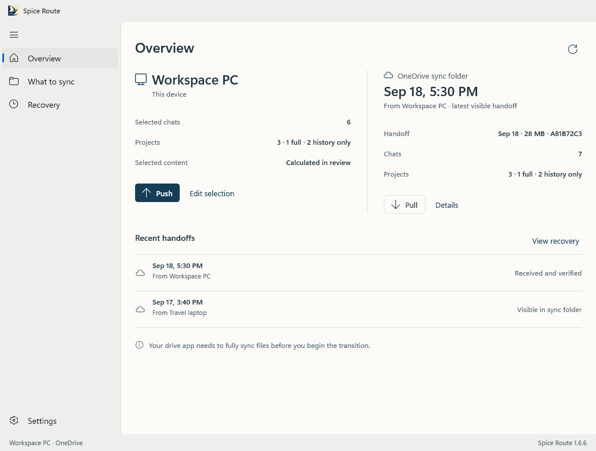
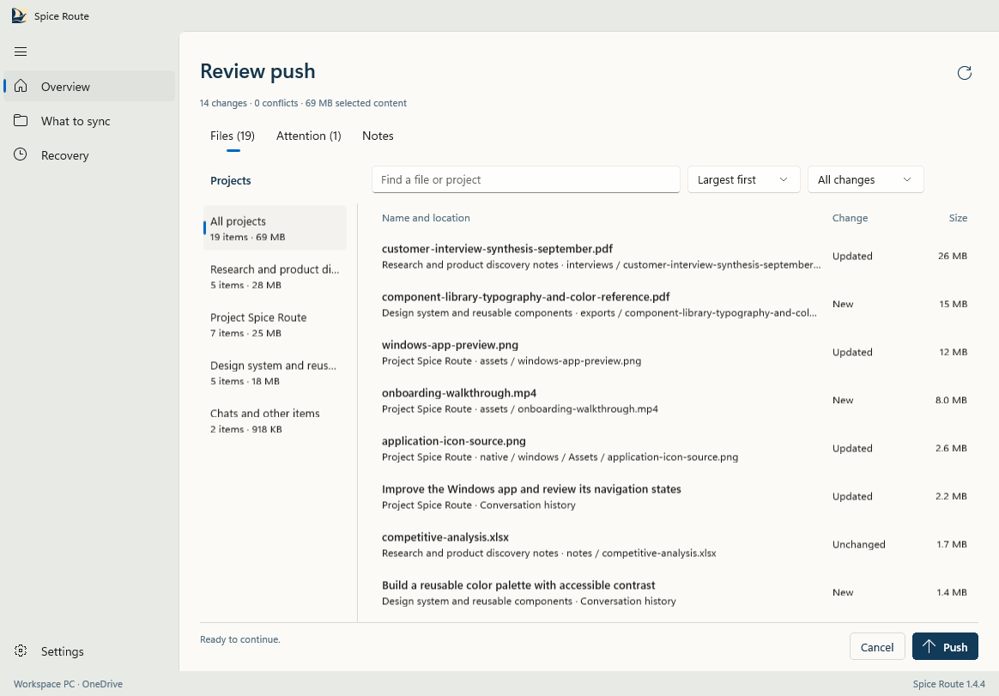

  

# Project Spice Route

**Got multiple devices like I do? Start a project on one PC, and pick up your Codex work on another.**

Spice Route is a desktop app that carries the chats and project work you choose through a folder synced by OneDrive, Google Drive, or iCloud Drive. Bring a whole project, including its files and Git history, or take just the conversations. Your cloud app handles sign-in and delivery.

[Windows x64](artifacts/Spice-Route-1.6.6-windows-x64-setup.exe) · [Windows ARM64](artifacts/Spice-Route-1.6.6-windows-arm64-setup.exe) · [Mac, Apple Silicon](artifacts/macos-apple-silicon/Spice-Route-1.6.6-macos-apple-silicon.dmg)

*See what is selected here and compare it with the latest handoff visible in your sync folder.*

## Choose what travels

Select individual chats and give each project its own setting: **Full project**, **Chat history only**, or **Excluded**. A project can include several code folders, even when they live in different places on your computer.

## Make a handoff

1. Install Spice Route on both computers. Choose a dedicated cloud drive folder that syncs between them.
2. Choose your Codex tasks and history folder, usually `.codex`, then select the chats and project folders you want to carry. If you use a separate folder for projectless chat working files, choose that too. Codex’s internal `.codex/sessions` folder is already covered by that selection.
3. On the computer you are leaving, choose **Push** and review the handoff. Wait for your drive app to finish syncing.
4. On the other computer, match the handoff ID, choose **Pull**, review any conflicts, and continue in Codex.

*Review chats and files before publishing or restoring a handoff.*

Spice Route checks the content it receives and keeps a local recovery point before a Pull changes files. Your Codex settings and credentials stay on each computer. A handoff visible in a sync folder may still be downloading, so check your drive app before switching devices.

Want a closer look? Follow the [visual handoff guide](docs/handoff-walkthrough.md). For setup and technical details, see the [architecture notes](docs/architecture.md) and [verification guide](docs/testing-1.6.6.md). If something goes wrong, [tell us what happened](https://github.com/desigrit/project-spice-route/issues).

Spice Route is an independent project, not an official OpenAI product. Windows installers are unsigned; the Mac package is ad-hoc signed and not notarized. There is no app-level encryption.
