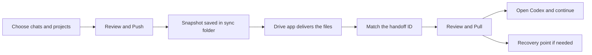
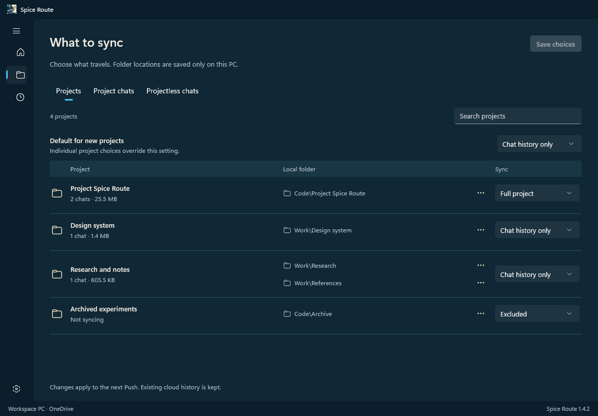
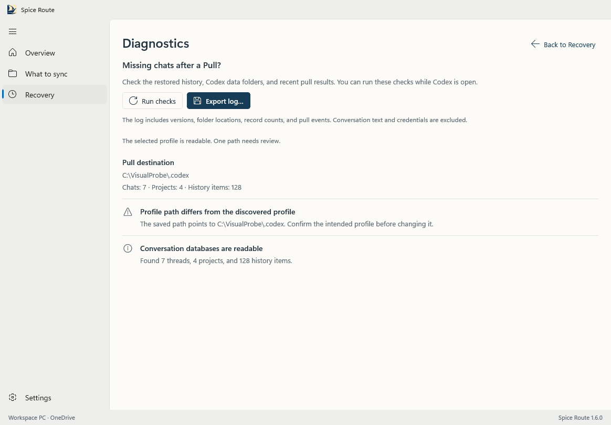

# How a Spice Route handoff works

Spice Route moves the Codex work you choose through a folder synced by your existing drive app. The two computers do not talk directly. One saves a handoff, and the other receives and reviews it.

## 1. Choose what travels

Select chats individually. Set each project to **Full project**, **Chat history only**, or **Excluded**. A full project includes its selected working files and Git state. A history-only project carries its listing and chats, leaving its code folders local to each computer.

## 2. Review and Push on the computer you are leaving

Overview shows your current selection on the left. Push opens a review of the files and chats in the proposed handoff. Spice Route saves an immutable snapshot and gives it a short ID. **Saved to sync folder** means the local write finished; it does not prove that the drive app finished uploading.

## 3. Let the drive app deliver the handoff

Wait for OneDrive, Google Drive, or iCloud Drive to finish syncing. On the receiving computer, check that the visible handoff has the source computer, time, and short ID you expect. Spice Route verifies the content objects during Pull because cloud clients can deliver files out of order.

## 4. Review and Pull on the receiving computer

Pull compares the incoming handoff with the local copy. New local projects and unrelated chats stay in place. If the same project or chat changed on both computers, choose which version to keep. A full project may need a local destination folder on this computer. Spice Route keeps a recovery point before applying changes.

After Pull succeeds, open Codex and continue your work. If history does not appear, use **Recovery > Diagnose missing chats** and export the log.

These images use fabricated data. The Overview image is from the 1.6.6 WinUI interface; the other Windows interface captures are from 1.6.0. They do not show a live transfer or imply that a cloud provider has completed delivery.
